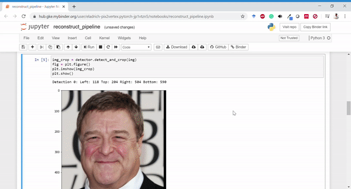

# Unrestricted Facial Geometry Reconstruction Using Image-to-Image Translation - Official PyTorch Implementation

[](https://mybinder.org/v2/gh/eladrich/pix2vertex.pytorch/mybinder-test?filepath=reconstruct_pipeline.ipynb)
[](https://badge.fury.io/py/pix2vertex)
[](https://opensource.org/licenses/MIT)


[[Arxiv]](https://arxiv.org/pdf/1703.10131.pdf) [[Video]](https://www.youtube.com/watch?v=6lUdSVcBB-k)


Evaluation code for Unrestricted Facial Geometry Reconstruction Using Image-to-Image Translation. Finally ported to PyTorch!




## Recent Updates


**`2020.05.07`**: Added a wheel package!

**`2020.05.06`**: Added [myBinder](https://mybinder.org/v2/gh/eladrich/pix2vertex.pytorch/mybinder-test?filepath=reconstruct_pipeline.ipynb) version for quick testing of the model

**`2020.04.30`**: Initial pyTorch release

# What's in this release?

The [original pix2vertex repo](https://github.com/matansel/pix2vertex) was composed of three parts
 - A network to perform the image to depth + correspondence maps trained on synthetic facial data
 - A non-rigid ICP scheme for converting the output maps to a full 3D Mesh  
 - A shape-from-shading scheme for adding fine mesoscopic details


 This repo currently contains our image-to-image network with weights and model ported from the `lua` version and a simple `python` postprocessing scheme.
 - The released network was trained on a combination of synthetic images and unlabeled real images for some extra robustness :)

## Installation
Installation from PyPi
```bash
    $ pip install pix2vertex
```
Installation from source
```bash
    $ git clone https://github.com/eladrich/pix2vertex.pytorch.git
    $ cd pix2vertex.pytorch
    $ python setup.py install
```
## Usage
The quickest way to try `p2v` is using the `reconstruct` method over an input image.
```
 import pix2vertex as p2v
 from imageio import imread
 image = imread(<some image file>)

 result, crop = p2v.reconstruct(image)

 p2v.vis_depth_interactive(result['Z_surface'])
```
For a more complete example see the `reconstruct_pipeline` notebook. You can give it a try without any installations using our [binder port](https://mybinder.org/v2/gh/eladrich/pix2vertex.pytorch/mybinder-test?filepath=reconstruct_pipeline.ipynb).

### Pretrained Model
Models can be downloaded from these links:
- [pix2vertex model](https://drive.google.com/open?id=1op5_zyH4CWm_JFDdCUPZM4X-A045ETex)
- [dlib landmark predictor](http://dlib.net/files/shape_predictor_68_face_landmarks.dat.bz2) - note that the dlib model has its own license.

If no model path is specified the package automagically downloads the required models.


## TODOs
- [x] Port Torch model to pyTorch
- [x] Release an inference notebook (using [K3D](https://github.com/K3D-tools/K3D-jupyter))
- [x] Add requirements
- [x] Pack as wheel
- [x] Ported to MyBinder
- [ ] Port the Shape-from-Shading method used in our matlab paper
- [ ] Write a short blog about the revised training scheme

## Citation
If you use this code for your research, please cite our paper <a href="https://arxiv.org/pdf/1703.10131.pdf">Unrestricted Facial Geometry Reconstruction Using Image-to-Image Translation</a>:

```
@article{sela2017unrestricted,
  title={Unrestricted Facial Geometry Reconstruction Using Image-to-Image Translation},
  author={Sela, Matan and Richardson, Elad and Kimmel, Ron},
  journal={arxiv},
  year={2017}
}
```
